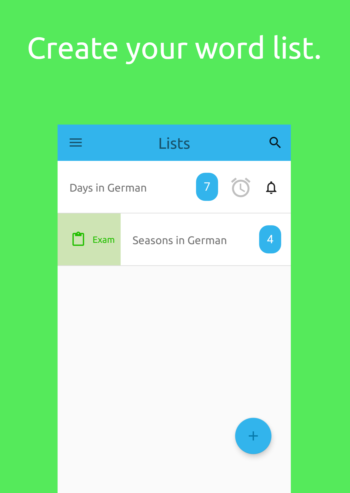
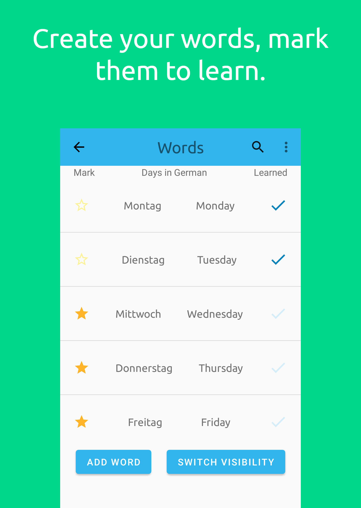
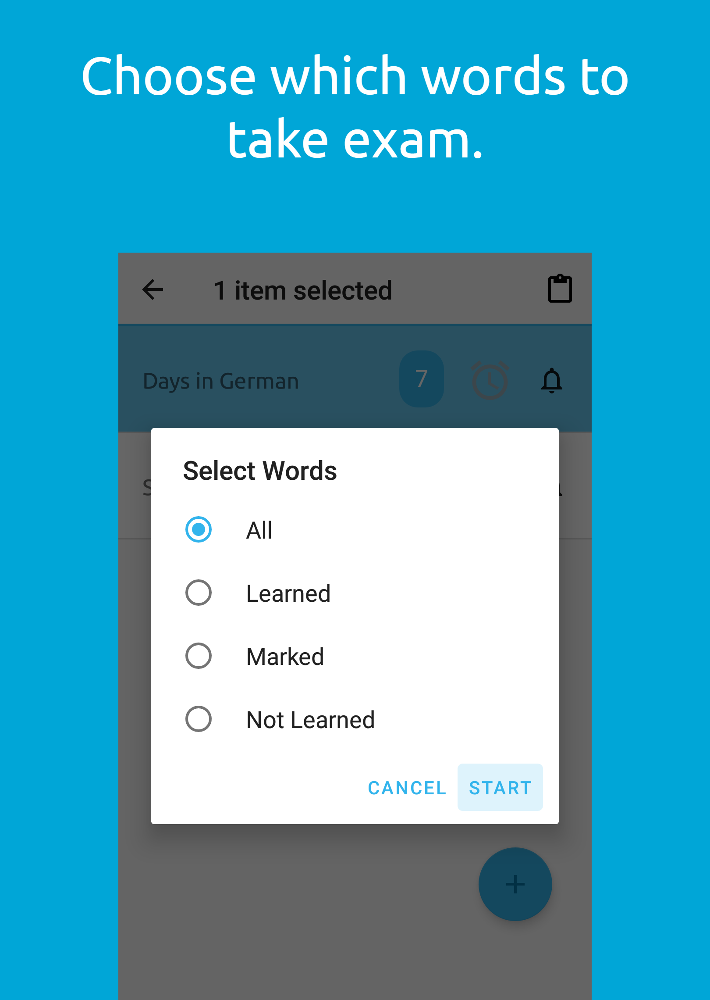
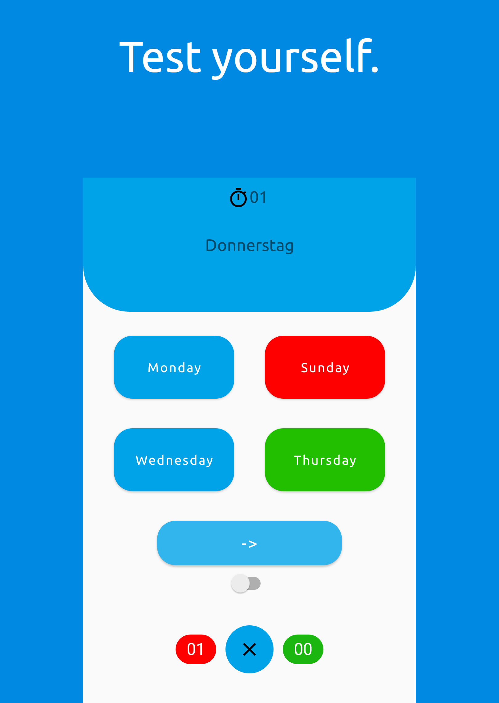
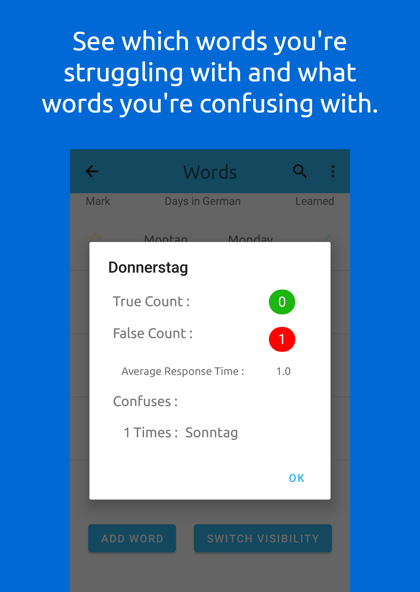

  

# Summary
Developed with Android Studio using Java for Android platform.
Memorize your own strange language words in a hierarchical way.

# Features
1. List Page.
    - [x] Create, edit, delete your lists.
    - [x] Select lists and words to put exam.
    - [ ] Periodically send notification of strange word and description.
2. Word Page.
    - [x] Create, edit, delete your words.
    - [x] Add words by Import 'Excel File'.
    - [x] Mark your words as like star or learned
    - [x] Look at the history of the selected word. 
      - [x] How many right or wrong choices did you make at exam.
      - [x] Which you confused with the words.
      - [x] How fast did you answer, the average of answer time.
    - [ ] Export words as 'Excel File'.
3. Exam Page.
    - [x] Auto pass after quetion answered.
4. Setting Page.
    - [ ] Font size.
    
# Screenshots

# Download

  

# Dependencies
- AndroidX
- RoomAPI / SQLite
- SwipeToAction : https://github.com/vcalvello/SwipeToAction
- Android5xlsx : https://github.com/andruhon/android5xlsx
- Google Ads
